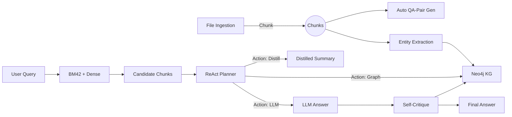

# RAGentX: A Next‑Gen Multi‑Agent RAG Platform

**RAGentX** fuses **Hybrid Retrieval**, **Knowledge Graphs**, and **Advanced LLM Reasoning** into an end-to-end context‑aware AI agent—optimised for enterprise‑scale, complex unstructured data.

🤖 AI-Powered Document Processing:

- Automatic Question Extraction: Upload documents and automatically extract structured questions
- Intelligent Response Generation: Generate contextual responses using your organization's documents
- Multi-Step AI Analysis: Advanced reasoning process that analyzes, searches(dense and sparse), extracts, and synthesizes responses
- Document Understanding: Supports Word, PDF, Excel, and Docs.
---

## 🎯 Elevator Pitch

RAGentX is a ground-breaking **multi-agent** framework that delivers:

- **Adapter‑Free Hybrid RAG (BM42 + Dense)** via **Qdrant**, blending high‑precision BM25 matches with semantic embeddings for lightning‑fast recall.
- **Graph‑RAG**: Leverages **Neo4j** to traverse multi-hop entity relationships, turning data silos into interconnected knowledge webs.
- **Chain‑of‑Thought (CoT) & ReAct**: Empowers LLMs to _think aloud_, plan actions, call retrieval or graph queries, and dynamically refine answers.
- **PEDRO/LoRA Fine‑Tuning**: Efficiently adapts QA models on your domain via **PEFT**, using auto‑generated question‑answer pairs.
- **Self‑RAG Self‑Critique**: Runs a secondary verification pass—retrieves evidence, distills context, and critiques its own output to eliminate hallucinations.
- **Contextual Awareness**: Session‑scoped cache, on‑the‑fly distillation, and persistent config empower seamless multi‑turn insights.
- **Possible Future Updates**: For enterprise scale and more accurate results, it is suggested to use a context window instead of sparse retrieval and also is suggestable to use neo4j graphs for cross-doc links in context windows. This can bring alot of change in retrieval 
---

---

## 🔍 Why  RAGentX Outperforms Traditional RAG Systems

1. **Truly Hybrid Retrieval (BM42 + Dense)**  
   - **Old way:** BM25 alone misses semantic matches; pure vector search can hallucinate or miss keywords.  
   - **RAGentX:** Combines BM25 and dense embeddings in Qdrant for best‑practice recall & precision.
2. **Graph‑RAG for Multi‑Hop Reasoning**  
   - **Old way:** Flat document retrieval can’t answer chained queries.  
   - **RAGentX:** Utilizes Neo4j graph traversal to enable true multi‑hop inferencing across entities.
3. **ReAct + Chain‑of‑Thought (CoT) Orchestration**  
   - **Old way:** Single‑shot LLM prompts produce brittle, hallucination‑prone answers.  
   - **RAGentX:** A multi‑tool ReAct loop (_Retrieve, Distill, Graph, LLM, Critique_) yields structured, traceable reasoning.
4. **PEDRO/LoRA Fine‑Tuned QA**  
   - **Old way:** Full‑model retraining is costly and time‑consuming.  
   - **RAGentX:** PEFT/LoRA adapters adapt in minutes on auto‑generated QA pairs, delivering domain‑specific accuracy without heavy compute.
5. **Self‑RAG Self‑Critique**  
   - **Old way:** Answers often lack provenance or verification.  
   - **RAGentX:** Automatically retrieves evidence, distills context, and prompts the model to critique its own output, drastically reducing hallucinations.
6. **Persistent Session Cache & Dynamic Config**  
   - **Old way:** Rebuilding indices per run loses workspace context.  
   - **RAGentX:** Maintains a durable session directory that survives restarts and allows on‑the‑fly hyperparameter tuning via Streamlit.

---

## 🏗 Pipeline Breakdown

1. **Ingestion & Chunking**  
   - **LlamaIndex** ingests PDFs, CSVs, Excels, TXTs → overlapping text chunks (configurable size/overlap).  
   - **Ollama LLM** auto‑generates QA pairs from each chunk for fine‑tuning.
2. **Hybrid Retrieval**  
   - **BM25** index over tokenized chunks + **dense embeddings** in Qdrant → unified candidate set.
3. **Knowledge Graph Construction**  
   - **spaCy NER** extracts entities → **Neo4j** MERGE stores nodes & relations.  
   - Supports multi‑hop **Cypher** queries for entity‑centric inferrence.
4. **QA Fine‑Tuning (PEDRO/LoRA)**  
   - Converts auto‑generated QA pairs into a **PEFT** adapter on any HuggingFace QA model.  
   - Outputs a lightweight, domain‑tuned QA head for precise answers.
5. **ReAct Agent & Self‑Critique**  
   - **Multi‑step loop:** Retrieve → Distill → Graph → LLM Answer → Self‑Critique.  
   - **New facts** from answers are re‑ingested into the KG for evolving context.
6. **API & Frontend**  
   - **FastAPI** serves session, ingest, and query endpoints.  
   - **Streamlit** UI for file uploads, parameter tuning, and interactive Q&A with color‑coded responses and logs.

---

## 🌟 Uniqueness & State‑of‑the‑Art

- **Holistic integration** of sparse & dense retrieval, graph reasoning, and self‑verifying ReAct planning—no other open‑source platform ties all these together.  
- **Real‑time LoRA adapters** via PEDRO remove the need for large‑scale retraining, making custom QA immediate.  
- **Self‑critique loop** ensures each answer is backed by distilled evidence, inspired by Self‑RAG research (Korshunova et al., 2023).  
- **Runtime‑configurable** via Streamlit: non‑engineers can tweak models, hyperparameters, and reasoning modes without code changes.  
- **Extensible**: swap out LLM providers (Ollama, OpenAI, HF), embed models, or graph backends with minimal code adjustments.

---

## 🔧 Tech Stack & Components

| Feature                               | Description                                                         | Reference                                |
|---------------------------------------|----------------------------------------------------------------------|------------------------------------------|
| **Hybrid BM42 + Dense**               | BM25 enhanced with vector search in Qdrant.                          | Qdrant BM42 blog                        |
| **Knowledge Graph (KG)**              | Neo4j-based entity & relation store with multi-hop Cypher queries.   | RAG (Lewis et al., 2020)                |
| **Chain‑of‑Thought (CoT)**            | Stepwise reasoning prompts inside ReAct agent.                        | Wei et al., 2022                         |
| **ReAct Agent**                       | Planning & acting loop: retrieve, distill, critique, graph, answer.   | Yao et al., 2023                         |
| **PEDRO/LoRA Fine‑Tuning**            | Parameter‑efficient domain adaptation of QA models.                  | [PEDRO preprint, 2024]                  |
| **Self‑Critique (Self‑RAG)**          | Automatic answer verification against retrieved evidence.             | Korshunova et al., 2023                  |
| **Plan‑and‑Solve Prompting**          | Ongoing LLM‑driven plan refinement.                                  | Shen et al., 2023                        |
| **Session Cache & Context**           | Durable session directory, clear on user command.                    | —                                        |

---

## 🏗 Architecture Diagram



RAGentX : https://huggingface.co/spaces/VictorGearhead/RAGentX (Runs on 16GB VRAM, might be slow)
(suggested to refer for further debugged code and more features)

## ⚙️ Configuration & Streamlit Setup

All settings live in `config.py` (or can be adjusted at runtime via the Streamlit sidebar). No manual `.env` edits required—just start the Streamlit UI and set:

- **Qdrant URL**
- **Neo4j URI/User/Pass**
- **Embedding Model**
- **LLM Provider & Model & Key**
- **Session Directory**
- **Chunk Size & Overlap**
- **LoRA Hyperparams & PEFT settings**
- **Fine‑tuning params (epochs, batch size, LR)**

---

## 🖥️ Quickstart

```bash
cd RAGentX
docker-compose up --build
```

• **Start Session** → **Ingest** → **Ask Questions** → **End Session**  
• Toggle **Fallback** and **Think** in UI for LLM fallback & CoT  
• Upload multiple files at once  
• View answers, distilled summaries, and self‑critique in distinct colored panels

---

## 📖 Citations

1. _Retrieval‑Augmented Generation_ (RAG), Lewis et al., 2020.  
2. _Self‑RAG: Self‑Critique in Retrieval‑Augmented Generation_, Korshunova et al., 2023.  
3. _ReAct: Reason + Act in Language Models_, Yao et al., 2023.  
4. _Plan‑and‑Solve Prompting_, Shen et al., 2023.  
5. _PEDRO: PEFT for QA Task Adaptation_, 2024 preprint.  
6. _BM42: BM25 + Vector Search_, Qdrant Tech Blog.  
7. _Multi‑Agent RAG Orchestration_, Rayo et al., 2025.

---
